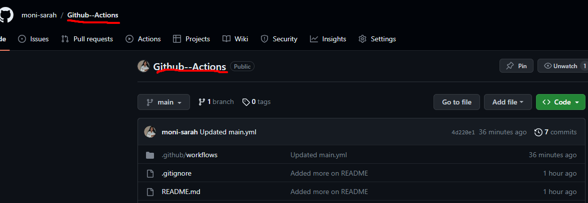

# Github--Actions
## Del 1: Github-repo med Azure Environment-variabler
-Lag et nytt GitHub-repositorium med navn som "GITHUB-ACTIONS"
Legg til en .env-fil  for å lagre Azure Environment-variabler. Dette kan inkludere ting som ARM_CLIENT_ID, ARM_CLIENT_SECRET, ARM_SUBSCRIPTION_ID, ARM_TENANT_ID.
 Legge til .env i .gitignore for å unngå å laste opp sensitiv informasjon til GitHub.
 

## Del 2: Konfigurere Terraform Backend for tfstate-fil
Jeg har Opprettet en Terraform-konfigurasjonsfil  "backend.tf" og konfigurer backend for å lagre tfstate-filen. 

## Del 3: Opprette en Terraform-konfigurasjon for testressurs

## Del 4: GitHub Actions for CI/CD 
Opprett en mappe .github/workflows/ i roten av mitt GitHub-repositorium.

Opprettet  en fil (terraform.yml) og konfigurer GitHub Actions-workflowen.

Etter å ha fulgt disse trinnene, jeg har fått  en grunnleggende CI/CD-workflow som kan utføre Terraform-operasjoner når det skjer endringer i hovedgrenen på GitHub-repositoriet. 

## Utfordringer 
jeg har hatt 
Flere faktorer kan skape utfordringer når du arbeider med oppgaver knyttet til konfigurering av infrastruktur, spesielt med verktøy som Terraform, GitHub og Azure. Her er noen potensielle utfordringer du kan møte:

1. Miljøspesifikke konfigurasjoner:
   - Å håndtere miljøspesifikke konfigurasjoner, for eksempel Azure-miljøvariabler og nøkler, kan være utfordrende. Sørg for å bruke sikre metoder for å håndtere og dele disse konfigurasjonene.

   - Vær forsiktig med å lagre sensitive data som nøkler og hemmeligheter direkte i GitHub-repositoriet. GitHub Actions gir metoder for å administrere hemmeligheter, men det krever bevissthet og riktig konfigurasjon.

2. Azure-tilgang og tillatelser:
   - Sørg for at tjenesteidentiteten eller brukeren som brukes i Terraform-konfigurasjonen, har riktige tillatelser til å opprette, endre og slette ressurser i Azure.

3. Terraform Backend Konfigurasjon:
   - å Håndtering av Terraform backend-konfigurasjon har vært en  utfordrende. 

4. GitHub Workflow Konfigurasjon:
   - GitHub Actions-konfigurasjonen, jeg har hatt mye feilmeldinger, jeg har prøvde flere ganger til å kunne riktig satt opp riktig og   å sikre at Terraform-operasjoner blir utført på riktig måte. Eventuelle feil i YAML-filen kan føre til uventet atferd i CI/CD-workflowen.

For å håndtere disse utfordringene, er det viktig å ta sikkerhetskopier, bruke versjonskontroll, implementere sikkerhetsbestemmelser og benytte seg av infrastruktur som kode (IaC) beste praksiser. Test også nøye før du implementerer i produksjonsmiljøet for å redusere risikoen for uforutsette problemer.